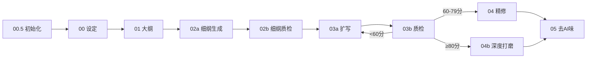

# 项目初始化师 V1.0

> 本技能填补了原流水线的"项目文件系统"空白。在设定架构之前执行，为全书工程提供统一目录结构和跨会话追踪能力。

---

## 📍 在完整流水线中的位置

> 完整流水线图见 [README.md 流水线总览](README.md#流水线总览)



> **当前步骤**：Step 0 — 项目初始化

> **核心使命**：在设定和大纲之前，先建立全书工程骨架，确保所有产出物路径统一、跨会话可追踪。

---

## 执行流程

### 第一步：确认项目基本信息

> **⚠️ Inversion Gate（硬阻断）**
> 在以下 6 项必填信息全部确认前，**禁止执行 Step 2 及后续步骤**。
> 任何一项缺失 = 项目骨架不完整 = 下游 00 设定架构师无法正确工作。
> 如用户表示"先建目录，信息后补"，须明确告知：缺少必填信息将导致 02a 衔接包 P0 字段缺失、03b 质量评分降级、09 审稿一致性审计失败。

与用户确认以下信息：

| 信息 | 说明 |
|------|------|
| 书名 | 最终书名（如未定，用暂定名） |
| 作者 | 笔名 |
| 类型 | 都市/玄幻/悬疑/言情等 |
| 平台 | 番茄小说/七猫/起点/晋江/B站轻小说/飞卢/纵横/知乎盐言/通用 |
| 预计总字数 | 如100万字 |
| 项目根目录 | 存放路径，如 `C:\Users\xxx\Desktop\小说\书名\` |

### Gate 检查清单（全部为 ✅ 方可进入 Step 2）

- [ ] 书名已确认（非空，非"暂定"）
- [ ] 作者已确认（非空）
- [ ] 题材已确认（须匹配 00 设定架构师支持的题材列表）
- [ ] 目标平台已确认（番茄/七猫/起点/晋江/B站轻小说/飞卢/纵横/知乎盐言/通用）
- [ ] 预计总字数已确认（须为数字，≥3万）
- [ ] 项目根目录已确认（路径存在且可写）

> 如有任何一项为 ❌，**停止执行**，向用户说明缺失项并请求补充。

### 第二步：生成标准目录结构

**前置检查**：确认 Step 1 的 Gate 检查清单全部为 ✅。如有 ❌ 项，返回 Step 1。

在项目根目录创建以下结构：

```
{书名}/
├── 设定/
│   ├── 00_产出_设定文档.md          ← 00设定架构师产出
│   └── 00_产出_JSON元数据.json       ← 00设定的JSON接口数据
├── 大纲/
│   ├── 01_产出_分卷大纲.md           ← 01大纲构建师产出
│   └── 01_产出_情绪曲线图.md         ← 可选：可视化情绪曲线
├── 细纲/
│   ├── 02a_产出_全书细纲.md          ← 02a细纲生成产出
│   └── 衔接包链/
│       ├── Ch1_衔接包.md
│       ├── Ch2_衔接包.md
│       ├── 归档/                      ← 压缩归档的旧衔接包
│       │   └── handoff_compressed_Ch1-10.json
│       └── ...                       ← 逐章衔接包（全书链条）
├── 正文/
│   ├── 初稿/                         ← 03扩写系统产出
│   │   ├── Ch1_初稿.md
│   │   ├── Ch2_初稿.md
│   │   └── ...
│   ├── 精修/                         ← 04精修师产出
│   │   ├── Ch1_精修.md
│   │   ├── Ch2_精修.md
│   │   └── ...
│   └── 终稿/                         ← 05去AI味产出
│       ├── Ch1_终稿.md
│       ├── Ch2_终稿.md
│       └── ...
├── 追踪/
│   ├── 上下文管理模板.md              ← 跨会话追踪
│   ├── 伏笔追踪表.md                  ← 伏笔全生命周期
│   └── 状态快照库.md                  ← 03模块M语调配图快照
├── 对标/
│   └── {书名}/                          ← 06拆文师产出（多层目录结构）
│       ├── 角色.md                      ← 角色拆解+功能位映射
│       ├── 剧情.md                      ← 剧情结构拆解
│       ├── 设定.md                      ← 设定拆解
│       ├── 章节.md                      ← 逐章摘要
│       ├── 文风.md                      ← 文风拆解
│       └── 拆文报告.md                  ← 综合分析报告
└── 项目日志.md                        ← 记录每次会话的任务
```

### 第三步：填充上下文管理模板

基于项目信息自动填充 `追踪/上下文管理模板.md`，包含：

- 基本信息（书名/作者/类型/平台）
- 当前进度（初始化为第1卷第0章）
- 角色状态表（预留空表，待设定文档填充）
- 伏笔追踪表（预留空表）
- 文件索引（指向标准目录下的各文件路径）
- 快速恢复命令（预填书名和路径）

### 第三点五步：Hook自动配置（V5.3新增）

运行 `node scripts/setup-hooks.js` 自动检测平台并配置hooks。

支持平台：Trae / Claude Code / OpenCode / Codex

配置后自动启用：
- **check-prose-after-write**（写后兜底）：每章写作完成后自动检测AI味模式
- **chapter-counter**（章节计数提醒）：自动追踪章节进度
- **session-start**（会话启动检查）：每次会话开始时验证上下文完整性
- **guard-outline-before-prose**（写前大纲守卫）：阻断无细纲直接写正文
- **detect-story-gaps**（故事缺口检测）：自动发现剧情漏洞
- **pre-compact**（压缩前检查）：上下文压缩前保留关键信息
- **post-chapter-update**（章节后更新）：章节完成后更新追踪文件
- **session-end**（会话结束检查）：会话结束时保存状态
- **check-rhythm-cross-chapter**（跨章节奏检测）：检测跨章节节奏连贯性

> 脚本会根据操作系统自动选择 `.ps1`（Windows）或 `.sh`（Unix/macOS）版本的 hook 文件。

### 第四步：输出项目初始化报告

```
【项目初始化报告】

书名：{书名}
作者：{作者}
类型：{类型}
平台：{平台}
预计字数：{预计字数}

目录结构已创建：{路径}
上下文管理模板已生成：{路径}/追踪/上下文管理模板.md

下一步：
→ 01. 小说设定架构师（填写角色/世界观/JSON元数据）
→ 02. 小说大纲构建师（规划分卷/情绪曲线）
```

---

## 上下文管理模板（标准版）

> 以下为自动生成的模板内容。每次会话开始和结束时更新。

```markdown
# 上下文管理模板

> 本模板用于跨会话的上下文管理，保证断点续跑时不丢失关键信息。

---

## 当前项目状态

### 基本信息

| 项目 | 内容 |
|------|------|
| 书名 | [{书名}] |
| 当前进度 | 第1卷 / 第0章 |
| 上次会话结束状态 | 项目初始化完成 |
| 下次会话起始任务 | 从设定架构师（步骤1）开始 |

### 当前活跃角色状态

| 角色 | 位置 | 身体状态 | 心理状态 | 关键持有物 | 战力等级 | 生死状态 |
|------|------|---------|---------|-----------|---------|---------|
| [主角] | [地点] | [状态] | [状态] | [物品] | [题材适配：玄幻=战力等级/都市=资源量级/言情=关系阶段/悬疑=推理阶段] | 存活 |
| [配角1] | [地点] | [状态] | [状态] | [物品] | [题材适配：玄幻=战力等级/都市=资源量级/言情=关系阶段/悬疑=推理阶段] | 存活 |

> **V3.5新增**：战力等级和生死状态列由00设定架构师的 `number_anchors` 和 `power_system` 填充，跨会话恢复时必须携带。每章完成后由02衔接包的[本章新增状态]同步更新（如角色突破/死亡）。

### 当前活跃伏笔

| ID | 伏笔名 | 埋设章 | 内容 | 预计回收 | 状态 |
|----|--------|:------:|------|:--------:|------|
| F001 | | Ch. | | Ch. | ACTIVE |

### 当前未解决的冲突/悬念

- [ ] [冲突1描述]

---

## 断点续跑检查清单

```
□ 上次写到哪一章了？
□ 那一章的状态是什么？（初稿/精修/去AI味/完成）
□ 当前角色的位置/伤势/关系状态？
□ 当前角色的战力等级和生死状态？（V3.5新增 — 对照number_anchors）
□ 有哪些伏笔还没回收？预计在哪章回收？
□ 衔接包链是否完整？（Ch.X → Ch.X+1 的衔接包是否存在）
□ 本章需要加载的上下游文件有哪些？
```

---

## 文件索引

### 上游依赖文件（只读）

| 文件 | 说明 | 路径 |
|------|------|------|
| 设定文档 | 00产出 | `设定/00_产出_设定文档.md` |
| 分卷大纲 | 01产出 | `大纲/01_产出_分卷大纲.md` |
| 全书细纲 | 02a产出 | `细纲/02a_产出_全书细纲.md` |

### 当前工作文件

| 文件 | 说明 | 状态 |
|------|------|------|
| 第X章初稿 | 03产出 | [待精修/已完成] |
| 第X章精修 | 04产出 | [待去AI味/已完成] |
| 第X章终稿 | 05产出 | [已完成/未开始] |

---

## 快速恢复命令

```
我正在写一本网文《{书名}》，当前进度第[X]卷第[X]章。
上次会话完成了：[具体任务]
当前角色状态：[主角]在[地点]，[身体状态]，[心理状态]
当前活跃伏笔：[简要列出]
未解决冲突：[简要列出]
下一步：[具体任务描述]
```

---

## 每章完成后的更新清单

```
□ 更新"当前进度"字段
□ 更新"当前活跃角色状态"表
□ 更新"当前活跃伏笔"表
□ 更新"当前未解决的冲突/悬念"
□ 记录本次会话到"会话记录"
□ 更新"文件索引"中的工作文件状态
□ 更新"快速恢复命令"模板中的关键信息
```
```

---

## 流水线契约

- **本技能只在项目启动时执行1次**，不是每章循环
- **产出目录结构**后，后续所有技能按照约定路径读写文件
- **上下文管理模板**由用户或外部脚本更新，本技能不负责自动维护
- **对标目录**预留给06拆文师使用，如不使用拆文可忽略
- **本技能不收集创作素材**：用户已有的设定/灵感/旧稿素材由第1步（00设定架构师）负责收集。项目初始化只建骨架，不填内容
- **第0步是全书第1步**：即使从后续步骤开始，也应确认项目目录结构是否存在——若不存在或路径不统一，先补执行项目初始化

---

## Inversion Gate 设计说明

本技能采用 Inversion 模式的硬阻断设计：
- 必填信息未收集完成前，禁止生成目录结构和填充模板
- 这是防止"半成品骨架"流入下游步骤的工程保障
- 与 00 设定架构师的"创作内容收集"形成互补：
  - 00.5 管"工程骨架"（硬阻断）
  - 00 管"创作内容"（软引导）
