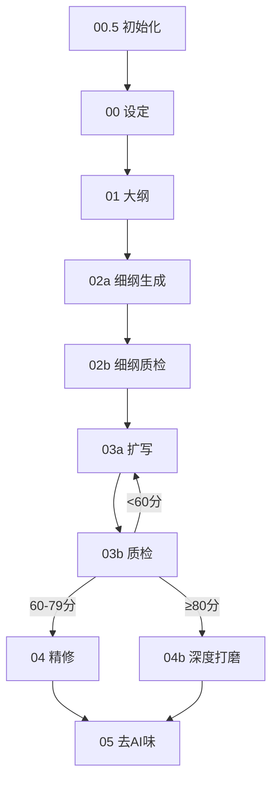

# fiction-writing Skill 完善任务列表

> 基于全网深度研究，覆盖19个已确认问题的详细修改方案。
> 每个任务含：问题摘要、修改方案要点、涉及文件、复杂度、参考来源。

---

## 总览表

| # | 任务 | 集群 | 优先级 | 复杂度 | 涉及文件 |
|---|------|------|--------|--------|---------|
| 1 | 修复情绪词子串匹配误报 | 脚本精度 | P0 | 中 | check-emotion-density.js |
| 2 | 修复距离/数值检查误报 | 脚本精度 | P0 | 中 | check-consistency.js |
| 3 | 修复意象/感官词提取误报 | 脚本精度 | P1 | 中 | check-ai-patterns.js, check-quality-score.js |
| 4 | 修复中文数字解析缺万/亿 | 脚本精度 | P0 | 低 | check-quality-score.js |
| 5 | TTR从字符级改为词级 | 脚本精度 | P1 | 高 | prose-utils.js, check-ai-patterns.js |
| 6 | 修复引号嵌套替换错误 | 脚本精度 | P0 | 中 | normalize-punctuation.js |
| 7 | 消除素材库合并版/独立版冗余 | 工程架构 | P1 | 高 | references/ 约13个文件 |
| 8 | 修复Agent路径硬编码 | 工程架构 | P1 | 中 | 5个Agent文件 + 新建脚本 |
| 9 | 结构化04→05交接协议 | 工程架构 | P2 | 高 | 04, 05, 交接协议 + 新建Schema |
| 10 | 对齐Schema与脚本输出 | 工程架构 | P1 | 中 | findings.schema.json, check-quality-score.js |
| 11 | 修复版本号管理混乱 | 工程架构 | P2 | 低 | README, sync-versions.js |
| 12 | 更新过时流水线图 | 工程架构 | P2 | 中 | 00.5, 00, 01, README |
| 13 | 修复断裂文件引用 | 工程架构 | P0 | 低 | SKILL.md + 新建脚本 |
| 14 | power_system多题材重构 | 流程设计 | P0 | 高 | 00_小说设定架构师.md |
| 15 | 为INC 13要素添加YAML输出 | 流程设计 | P0 | 中 | 01_小说大纲构建师.md |
| 16 | 02a模块化拆分降载 | 流程设计 | P1 | 高 | 02a + 新建~7个模块文件 |
| 17 | 04b快速通道Gate分级 | 流程设计 | P1 | 中 | 04b_深度打磨.md |
| 18 | 09审稿分级触发机制 | 流程设计 | P1 | 中 | 09_多视角审稿师.md |
| 19 | 扩展样本+读者反馈模板 | 流程设计 | P2 | 高 | samples/, 10_读者反馈注入师.md |

---

## 推荐执行顺序

### 第一批（P0 低风险独立修复）
任务4 → 任务6 → 任务13 → 任务11

### 第二批（P0 核心质量修复）
任务1 → 任务2 → 任务10 → 任务15

### 第三批（P0 架构性重构）
任务14 → 任务16

### 第四批（P1 中优先级改善）
任务3 → 任务5 → 任务7 → 任务8 → 任务17 → 任务18

### 第五批（P2 完善性提升）
任务9 → 任务12 → 任务19

---

## 集群A：检测脚本精度修复（任务1-6）

### 任务1：修复check-emotion-density.js子串匹配

**问题**：indexOf子串匹配导致"头痛"匹配"痛"、"痛快"跨类别双重计数，情绪密度虚高60-80%

**修改方案**：
1. 构建情绪词Trie树（前缀字典），将所有情绪词插入Trie
2. 实现正向最大匹配（FMM）分词算法：从位置i开始，从最长词开始尝试匹配，匹配成功后i+=word.length跳过已匹配词
3. "痛苦"只计1次（不再分别计"痛"+"苦"+"痛苦"），"头痛"不计数（长词优先匹配后跳过单字）
4. 替换原有第132-144行的扫描逻辑为FMM提取

**预期效果**：误报率降低60-80%，"头痛""痛快""刻苦"等不再误计数

**参考**：最大匹配算法（FMM），中文NLP标准分词方法

---

### 任务2：修复check-consistency.js距离检查误报

**问题**：正文所有数字与metadata距离值逐一交叉比对（O(N×M)），"三步远"vs"500米"也报警

**修改方案**：
1. 量词单位过滤：定义DISTANCE_UNITS表（里/米/步/丈/公里），只比对相同单位的距离
2. 路线名绑定：从metadata路线名提取地点关键词，正文上下文需包含至少一个关键词才比对
3. 近似容差：±10%误差不报警
4. 方向一致性检查保留

**预期效果**：误报率降低70-90%，"三步远"不再与"500米"误比

**参考**：NER上下文验证策略，信息抽取领域实践

---

### 任务3：修复意象/感官词提取误报

**问题**：单字匹配"库|光|声|影|味|气|色|雾"，"图书馆""办法""生气"被误判为意象重复

**修改方案**：
1. 构建感官词Trie树 + 排除词列表
2. 排除搭配表：`{ '看': ['看待','看重','看法'], '声': ['声明','声张','不动声色'], '苦': ['刻苦','困苦','苦笑'], '冷': ['冷静','冷淡','冷漠'] }`
3. 最大匹配优先：遇到"不动声色"优先匹配为排除词，跳过单字"声"
4. 与任务1共用Trie+FMM代码模板

**预期效果**：感官词误计数减少50-70%，质感密度评分更准确

**参考**：中文修辞检测方法，词性标注过滤思路

---

### 任务4：修复parseChineseNumberSimple缺万/亿

**问题**：UNITS字典缺少'万':10000和'亿':100000000，"三万"返回3，"百万"返回100

**修改方案**：
1. 直接复用check-consistency.js的parseChineseNumber实现（段分隔符方案）
2. SECTION_UNITS = { '万': 10000, '亿': 100000000 }（段分隔符，乘法）
3. DIGIT_UNITS = { '十': 10, '百': 100, '千': 1000 }（段内累加）
4. 算法：遍历字符，遇到数字存tempDigit，遇到段内单位累加到sectionValue，遇到段分隔符执行 totalValue = (totalValue + sectionValue) * SECTION_UNITS[char]

**验证用例**：
- "三万" → 30000（旧版返回3）
- "百万" → 1000000（旧版返回100）
- "三亿" → 300000000（旧版返回3）
- "十万" → 100000（旧版返回10010）
- "二十三" → 23（不变）

**预期效果**：含大数字的句子不再被误判为信息密度低

**参考**：中文数字分段进位制标准算法

---

### 任务5：TTR从字符级改为词级

**问题**：calculateTTR按单字分割，"今天天气"字符TTR=0.75但实际只有2个词。系统性偏高，AI文本检测灵敏度低

**修改方案**：
1. 在prose-utils.js中实现轻量级中文分词器segmentChinese()（FMM，零npm依赖）
2. 内嵌约500词常用词典（代词/副词/动词/形容词/名词/心理情绪词）
3. 分词逻辑：非中文字符按英文/数字序列分组；中文字符按最大匹配（maxLen=4）查词典，匹配失败则单字独立
4. TTR改为：unique words / total words（替代 unique chars / total chars）
5. 同步调整check-ai-patterns.js的TTR阈值（从0.4降至约0.25，因词级TTR普遍低于字符级）

**预期效果**：TTR从0.65-0.80降至0.40-0.60，更敏感地反映词汇重复

**参考**：上海外国语大学TTR/STTR定义，Kobak et al. AI写作TTR研究

---

### 任务6：修复normalize-punctuation.js引号嵌套

**问题**：运算符优先级导致 quoteOpen || ch === '\u201d' ? '」' : '「' 在嵌套开引号时误判为闭引号。场景：quoteOpen=true时遇到左弯引号\u201c，条件短路为true，输出」而非「

**修改方案**：
1. 用栈深度depth替代布尔值quoteOpen跟踪嵌套层级
2. Unicode开引号\u201c（"）总是输出「并depth++，不受当前状态影响
3. Unicode闭引号\u201d（"）总是输出」并depth--
4. ASCII双引号"用启发式判断：depth=0时必为开引号；depth>0时检查前一个非空字符，标点/空白→开引号，汉字/字母→闭引号
5. 跨行状态从布尔值改为depth数值传递

**预期效果**：嵌套引号"外层'内层'外层"正确输出「外层「内层」外层」

**参考**：中文引号配对算法，状态机模型

---

## 集群B：工程架构修复（任务7-13）

### 任务7：消除素材库合并版/独立版冗余

**问题**：语言素材综合库.md与5个独立库并存，协议综合.md与3个独立协议并存，方法论综合.md与Part_K/L/M并存

**修改方案**：
1. 创建references/_archive/目录，将所有独立版移入
2. 每个独立版顶部添加弃用声明：⚠️ DEPRECATED: 已合并至XX.md
3. 统一所有skill文件的YAML引用指向合并版
4. 在scene-trigger-map.md中标注独立版为[ARCHIVED]
5. 新增scripts/check-references.js检测是否有文件引用archive目录

**涉及的三组文件**：
- 语言素材综合库.md ← 成语库.md / 俗语惯用语库.md / 歇后语库.md / 怼人话术库.md / 网文通用高频词替换库.md
- 协议综合.md ← 00_严谨性校验协议.md / 02_伏笔全生命周期管理.md / 04_交接协议.md
- 方法论综合.md ← Part_K / Part_L / Part_M / 00_命名协议.md / 03_新事物释放协议.md / 03_质感锚点库.md

**预期效果**：消除内容不一致风险，修改素材只需改一处

**参考**：Single Source of Truth (SSOT)原则，DRY原则在文档中的应用

---

### 任务8：修复Agent路径硬编码

**问题**：.trae/agents/下5个Agent文件的协作表仍硬编码.claude/agents/路径（共16处），Trae平台Agent间调用可能失败

**修改方案**：
1. 建立Agent源文件目录agents/（项目根），作为唯一编辑源
2. 源文件协作表使用平台无关路径：agents/story-editor.md
3. 扩展sync-versions.js为sync-platforms.js，部署时自动替换路径：
   - 部署到.claude/agents/时替换为.claude/agents/
   - 部署到.trae/agents/时替换为.trae/agents/
4. 或简化方案：协作表路径列改为"Agent标识符"列（如story-editor），不显示具体路径

**预期效果**：消除Trae平台路径误导，Agent源文件只维护一份

**参考**：平台抽象层（PAL）设计模式，跨平台配置管理

---

### 任务9：结构化04→05交接协议

**问题**：04/05职责交叉依赖自然语言标记，05引用的"边界模糊"标记在04交接包模板中不存在，无Schema约束

**修改方案**：
1. 新建schemas/refinement-intent.schema.json定义精修意图包结构
2. 结构化字段：
   - processed_items：[{category, status(fully_processed/partially_processed/skipped), gate_id}]
   - boundary_ambiguous_items：[{location, description, gate_id}]
3. 05执行逻辑：读取processed_items中status=fully_processed→跳过初检；读取boundary_ambiguous_items→仅检测这些位置
4. 新建scripts/check-handoff-package.js验证交接包格式
5. 无交接包时降级为全量检测（保留现有异常处理）

**预期效果**：消除"边界模糊"标记不存在导致的执行歧义，交接从自然语言升级为结构化数据

**参考**：多步骤流水线任务交接协议设计，detection deduplication

---

### 任务10：对齐Schema与脚本输出

**问题**：findings.schema.json的score对象只有objective/llm/total三字段，但check-quality-score.js输出5维度子分（字数/对话/burstiness/TTR/信息密度），字段不匹配

**修改方案**：
1. 在Schema中添加objective_details字段（含5维度子分），设为required
2. 将llm_subjective_score/total_score改为optional（脚本只出客观分，LLM分由03b补充）
3. 添加llm_max_score和threshold字段
4. 脚本输出中添加llm_subjective_score: null占位
5. 新建scripts/validate-schema.js验证输出格式

**字段映射表**：
| Schema字段 | 脚本输出 | 操作 |
|-----------|---------|------|
| objective_details（新增） | objective_details | 添加到Schema |
| objective_score | objective_score | 已对齐 |
| llm_subjective_score | （无，需占位） | 脚本添加null占位 |
| total_score | total_max | 统一字段名 |
| threshold（新增） | threshold | 添加到Schema |

**预期效果**：Schema与脚本输出完全对齐，可程序化验证质检报告格式

**参考**：JSON Schema作为数据契约，Schema-First设计模式

---

### 任务11：修复版本号管理混乱

**问题**：00实际V3.5.1但README标注V2.6，01实际V2.3但README标注V2.5，sync-versions.js缺少02a/02b

**修改方案**：
1. 以YAML frontmatter的version字段为版本号SSOT
2. 修正README版本表：00→V3.5.1、01→V2.3.0
3. 在sync-versions.js的SKILL_FILES列表中添加02a_细纲生成.md和02b_细纲质检.md
4. 将版本检查纳入session-start hook

**版本不一致矩阵**：
| 文件 | YAML版本 | README标注 | 操作 |
|------|---------|-----------|------|
| 00_设定架构师 | 3.5.1 | V2.6 | README改为V3.5.1 |
| 01_大纲构建师 | 2.3.0 | V2.5 | README改为V2.3.0 |

**预期效果**：版本号一致性，sync-versions.js覆盖所有文件

**参考**：语义化版本控制（Semantic Versioning 2.0.0）

---

### 任务12：更新过时流水线图

**问题**：00.5、00、01三个文件的ASCII流水线图仍显示旧版7步（0-6），未反映03a/03b拆分和04b新增

**修改方案**：
1. 将ASCII图替换为Mermaid流程图（Diagram-as-Code）
2. 在README.md中维护唯一源图
3. 00.5/00/01三个文件改为引用README中的图
4. 图中体现：02a/02b/03a/03b/04b全部分支 + 评分驱动的流程路由

**Mermaid示例**：


**预期效果**：流水线图反映V5.2最新结构，修改只需改一处

**参考**：Mermaid Diagram-as-Code，C4 Model架构可视化

---

### 任务13：修复断裂文件引用

**问题**：SKILL.md第43行引用references/scene-trigger-map.md，该文件不存在（实际是references_index.md，且已废弃指向scene-trigger-map.md）

**修改方案**：
1. 修正SKILL.md第43行：references/scene-trigger-map.md → references/scene-trigger-map.md
2. 清理SKILL.md中对references_index.md的引用（第42行）
3. 新建scripts/check-references.js：扫描所有.md文件的YAML references字段，验证路径存在性
4. 将引用检查纳入session-start hook

**预期效果**：消除断裂引用，自动化防护未来新增断裂

**参考**：markdown-link-check工具，文档引用完整性检查

---

## 集群C：流程设计与题材适配（任务14-19）

### 任务14：power_system多题材重构

**问题**：JSON示例和Schema全是玄幻术语（骨骼/血核/荒兽/染煞），都市/言情/悬疑题材无法使用。4个替代模块仅一句话描述，无Schema

**修改方案**：
1. 将power_system重构为capability_system，使用system_type区分题材
2. 6种系统类型：
   - cultivation（玄幻）：修炼等级/战力边界/骨骼类型
   - social（都市）：社会阶层/资源调动/影响力半径/外在标识
   - emotional（言情）：好感度/信任度/亲密度三维 + 关系里程碑 + 误会机制
   - mystery（悬疑）：证据链 + 信息差矩阵 + 推理逻辑树
   - power_structure（历史架空）：权力层级/势力分布/权力更迭节点
   - null（非能力导向题材）
3. 为每种类型提供完整JSON示例 + TypeScript接口定义
4. number_anchors中cultivation_level改为通用capability_level
5. 使用JSON Schema oneOf/anyOf表达多态

**预期效果**：非玄幻题材获得同等深度的设定支撑，下游技能通过system_type自动选择校验逻辑

**参考**：D&D Ability Scores通用能力模型，策略模式（Strategy Pattern），JSON Schema oneOf

---

### 任务15：为INC 13要素添加YAML输出

**问题**：01大纲5.3节要求检查INC 13要素，但YAML输出接口无INC字段，检查结果无法传递给02a

**修改方案**：
1. 在volumes中新增inc_coverage字段：
   ```yaml
   inc_coverage:
     hit_count: 7
     passed: true
     hit_dimensions:
       - dimension: "①新信息"
         evidence: "[本卷揭示了什么]"
       - dimension: "②新冲突"
         evidence: "[本卷引入了什么矛盾]"
     missed_dimensions: ["④新场景", "⑧新反转"]
   ```
2. 在YAML末尾新增inc_global_audit：全书覆盖矩阵 + 相邻卷重叠检查（≥3项重叠=节奏雷同）
3. 02a可参考missed_dimensions在细纲中补入未覆盖维度
4. 02b可自动校验inc_coverage.passed

**预期效果**：INC检查从人工自检升级为机器验证，02a可针对性补入未覆盖维度

**参考**：Blake Snyder "Save the Cat"节拍表，Story Variable Tracker

---

### 任务16：02a模块化拆分降载

**问题**：02a共1597行，LLM执行率约50-65%。Lost in the Middle效应导致中间信息严重遗忘，衔接包P0字段可能被跳过

**修改方案**：
1. 将02a拆为核心层（≤400行）+ 扩展模块（按需加载）
2. 核心层包含：使命+衔接包机制(Part G)+章节结构(Part F2)+输出格式+模块加载决策表
3. 扩展模块拆为独立文件存入references/：
   - Part N爽感保护 → references/Part_N_爽感保护.md
   - Part F1流氓逻辑 → references/Part_F1_流氓逻辑.md
   - Part J动机显隐 → references/Part_J_动机显隐.md
   - Part G0黄金三章 → references/Part_G0_黄金三章.md
   - Part H定位修正 → references/Part_H_定位修正.md
   - Part I详细度保障 → references/Part_I_详细度保障.md
4. 场景触发加载表：
   | 场景 | 必须加载 | 推荐加载 | 可跳过 |
   |------|---------|---------|--------|
   | 首批建纲 | G+F2+输出+G0 | N+F1 | H+I.5 |
   | 滚动补纲 | G+F2+输出 | I | G0+N+F1 |
   | 卷首章 | G+F2+输出+I.5 | N+G0 | F1 |
   | 过场章 | G+F2+输出 | — | N+F1+G0+I.5 |
   | 高潮章 | G+F2+输出+N | H | F1 |
5. 衔接包P0字段前置（首因效应），输出格式后置（近因效应）
6. 增加模块执行确认字段

**预期效果**：核心prompt从1597行压缩到≤400行，执行率从50%提升到80%+

**参考**：Lost in the Middle (arXiv:2307.03172)，Progressive Disclosure，Agent Skills规范

---

### 任务17：04b快速通道Gate分级

**问题**：快速通道跳过Gate 4/5/8/9，其中Gate 5（对话差异化）和Gate 9（剧透式叙述）是高风险检测项

**修改方案**：
1. 将4个Gate分为"不可跳过"和"可条件跳过"：
   - 不可跳过：Gate 5精简版（对话差异化3项核心检测）、Gate 9精简版（剧透式叙述2项核心检测）
   - 可条件跳过：Gate 4（burstiness>0.45时跳过）、Gate 8（与Gate 4合并执行）
2. Gate 5精简版3项：角色声口一致性 + 对话腔调同质化 + 信息差对话检测
3. Gate 9精简版2项：意图直给检测 + 信息不对称破坏检测
4. 准入条件增加：03b质检"对话差异化"≥70分 + "信息差保持"≥70分

**预期效果**：对话同质化和剧透式叙述不再在快速通道被遗漏

**参考**：ISTQB Risk-Based Testing，SonarQube Quality Gate分级策略

---

### 任务18：09审稿分级触发机制

**问题**：每3章触发full审稿过于频繁，打断写作节奏，4Agent并行可能频繁降级

**修改方案**：
1. 改为分级触发：
   | 触发条件 | 模式 | 执行内容 |
   |---------|------|---------|
   | 每1章 | 脚本检测 | 确定性脚本自动运行，不启动LLM |
   | 每5章 | lean模式 | 主线程执行编辑+读者视角(2关) |
   | 每10章(卷末) | full模式 | 4Agent并行(4关)+一致性审计 |
   | 异常触发 | full模式 | 03b连续2章<70分/脚本发现blocking/手动调用 |
2. 审稿疲劳防护：连续3次full审稿>85分→自动降级lean
3. 累积机制：lean结果累积存储，full审稿时做趋势分析（同类问题重复？评分趋势下降？）

**预期效果**：打断从每3章减少到每5章lean+每10章full，减少40%审稿打断

**参考**：Google代码审查最佳实践，Review Fatigue研究

---

### 任务19：扩展样本+读者反馈模板

**问题**：仅3个样本（战斗/日常/情绪），缺少悬疑/言情/都市等题材。番茄后台数据需手动输入，无标准化模板

**修改方案**：
1. 样本从3个扩展到9个：
   | 编号 | 场景 | 验证重点 | 状态 |
   |------|------|---------|------|
   | ch01 | 战斗章 | 动作/节奏/战力 | 已有 |
   | ch02 | 日常章 | 对话/角色辨识 | 已有 |
   | ch03 | 情绪章 | 情绪工程/质感 | 已有 |
   | ch04 | 悬疑推理章 | 线索释放/信息差 | 新增 |
   | ch05 | 言情情感章 | 情感拉扯/潜台词 | 新增 |
   | ch06 | 转折高潮章 | 反转/情绪爆发 | 新增 |
   | ch07 | 过场过渡章 | 信息传递/伏笔 | 新增 |
   | ch08 | 字数下限(3500) | 标点限额边界 | 新增 |
   | ch09 | 字数上限(4500) | 信息密度边界 | 新增 |
2. 增加多题材样本：都市章(社会关系矩阵)、悬疑章(证据链)、言情章(情感图谱)
3. 设计番茄读者反馈YAML模板：完读率/追读率/书架比/催更人数/评论摘录
4. 10_读者反馈注入师增加自动分析：完读率跌幅分析、追读率趋势、评论关键词映射Gate

**读者反馈模板示例**：
```yaml
reader_feedback:
  collection_date: "2026-07-16"
  volume: 1
  chapters_covered: "Ch.1-Ch.10"
  metrics:
    chapter_completion_rate:
      ch2: 0.62
      ch10: 0.31
    追读率: 0.42
    书架比: 0.22
    催更人数: 15
  comments:
    - chapter: "Ch.3"
      type: "负面"
      content: "太水了，主角一直内心独白"
      action_needed: "压缩心理描写"
```

**预期效果**：回归测试覆盖面从30%提升到90%+，读者反馈从随意记录变为结构化输入

**参考**：等价类划分+边界值分析测试设计，番茄小说作者后台数据指标体系

---

## 参考来源汇总

1. Liu et al., "Lost in the Middle: How Language Models Use Long Contexts", arXiv:2307.03172, 2023
2. 最大匹配算法 (Maximum Matching) - 中文NLP标准分词方法
3. 上海外国语大学语料库研究院 TTR/STTR定义
4. Semantic Versioning 2.0.0 - https://semver.org/
5. JSON Schema官方规范 - https://json-schema.org/
6. Mermaid Diagram-as-Code
7. markdown-link-check工具 - https://github.com/tcort/markdown-link-check
8. D&D Ability Scores系统 - 通用能力模型
9. Blake Snyder "Save the Cat"节拍表 - 编剧行业标准
10. ISTQB Risk-Based Testing标准
11. SonarQube Quality Gate文档
12. Google Software Engineering 代码审查最佳实践
13. 番茄小说作者后台数据指标体系
14. KRAFTON AI arXiv:2511.21140 - 混合评分模型研究
15. Progressive Disclosure / Context Engineering - Agent设计趋势
